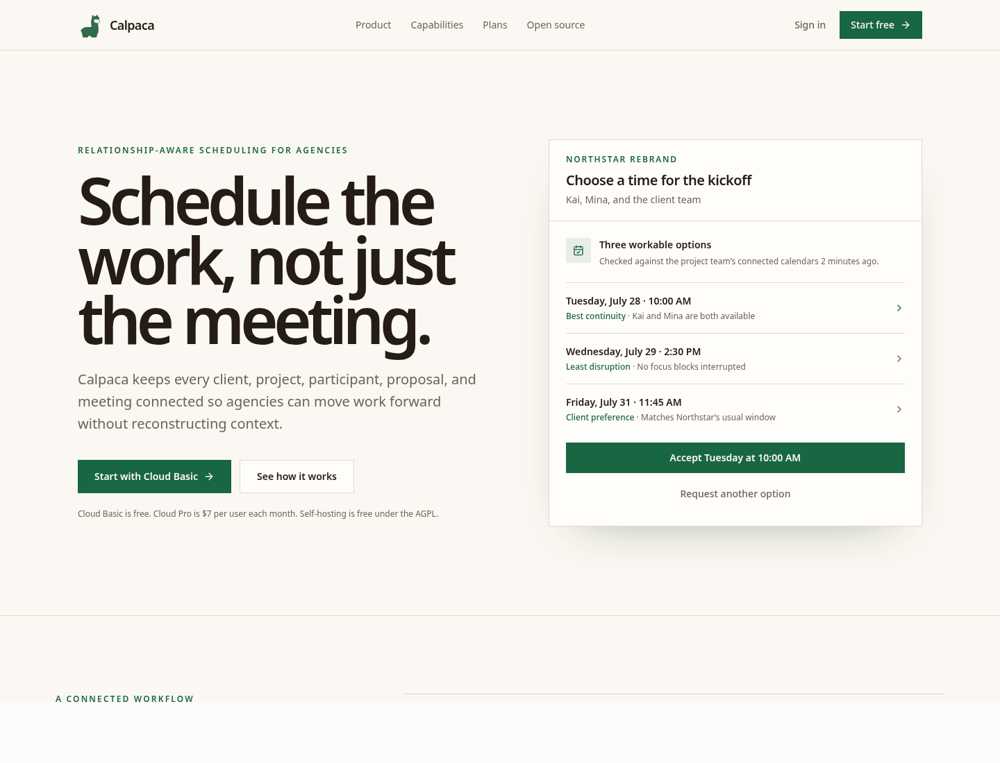
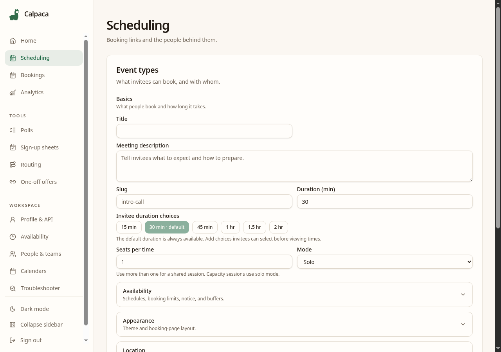
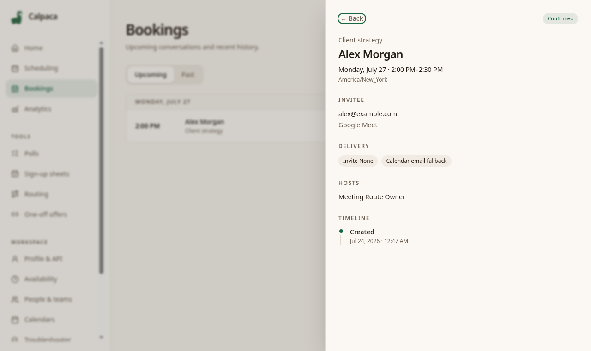
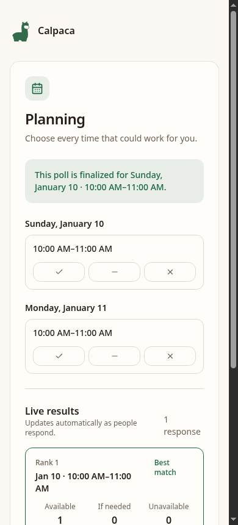

# Calpaca

Calpaca is relationship-aware scheduling for agencies. It keeps clients,
projects, participants, scheduling proposals, and meetings connected so every
conversation starts with the right context.

Use [Calpaca Cloud](https://app.calpaca.io/sign-in) for a managed workspace or
self-host the complete Community Edition under the AGPL.

[Website](https://calpaca.io) ·
[Architecture](docs/ARCHITECTURE.md) ·
[Product specification](docs/CALPACA-PRODUCT-SPECIFICATION.md) ·
[API reference](docs/API.md) ·
[MCP setup](docs/MCP.md) ·
[Cloud and self-hosting](docs/HOSTED.md)

## Releases

Calpaca uses Semantic Versioning. The package version is the source of truth,
release notes live in [CHANGELOG.md](CHANGELOG.md), and releases are tagged
`v<version>`. A running installation reports its version at `GET /version`.

## What makes Calpaca different

- **Engagements hold the relationship:** keep the client, project, assigned
  team, conversation playbooks, proposals, and meeting history together.
- **Conversations are reusable:** define purpose, participants, preparation,
  location, availability rules, and intended outcome once, then use that
  playbook throughout the engagement.
- **Proposals explain the options:** present a short list of workable times
  with reasons, evidence freshness, and a path to request an alternative.
- **Meetings retain context:** confirmed work remains connected to its
  engagement, participants, preparation, outcome, and follow-up.
- **The scheduling engine is complete:** solo, round robin, collective,
  capacity, polls, routing, one-off offers, sign-up sheets, questions,
  selectable durations, time off, and availability diagnostics share one
  calendar-aware foundation.
- **Automation uses the same rules:** the public API and MCP server support
  controlled availability, holds, booking, rescheduling, and cancellation.
- **Operations stay auditable:** Google Calendar sync, email fallback, signed
  webhooks, expiring holds, and an append-only booking event log protect the
  scheduling lifecycle.

## Screenshots









## Stack

TypeScript, Bun, Hono, React 19, Vite, Tailwind CSS v4, Drizzle ORM,
PostgreSQL 16, pg-boss, Better Auth, and the Temporal API.

## Quickstart

You need [Bun](https://bun.sh/) and PostgreSQL 16. The commands below start a
local PostgreSQL container; an existing PostgreSQL server works just as well.

```sh
git clone https://github.com/e1i3or-commits/Calpaca.git
cd Calpaca
bun install
cp .env.example .env.local

docker run --name calpaca-postgres \
  -e POSTGRES_USER=test \
  -e POSTGRES_PASSWORD=test \
  -e POSTGRES_DB=app \
  -p 5434:5432 \
  -d postgres:16

bunx drizzle-kit migrate
bun run build:web
bun run start
```

Open <http://localhost:3000>. The example environment is enough to start the
application, but Google sign-in, calendar sync, and email delivery remain
disabled until their credentials are configured.

For frontend development, run the API and Vite server in separate terminals:

```sh
bun run start
bun run dev:web
```

Then open <http://localhost:5173>.

> Keep `DATABASE_URL` and `TEST_DATABASE_URL` pointed at different databases.
> Integration tests truncate their database.

## Configuration

Copy `.env.example` to `.env.local`. The main settings are:

| Variable | Purpose |
|---|---|
| `DATABASE_URL` | PostgreSQL connection used by the application and jobs |
| `BETTER_AUTH_SECRET` | Session-signing secret |
| `BETTER_AUTH_URL` | Public application origin |
| `GOOGLE_CLIENT_ID`, `GOOGLE_CLIENT_SECRET` | Google OAuth and Calendar sync |
| `INVITEE_CALENDAR_CALLBACK_URL` | Optional canonical callback for the anonymous invitee calendar overlay; defaults to `${BETTER_AUTH_URL}/api/invitee-calendar/callback` |
| `PUBLIC_URL` | Public HTTPS origin for calendar webhooks and email links |
| `SMTP_URL`, `EMAIL_FROM` | Booking and reminder email delivery |
| `DISABLE_JOBS=1` | Disable in-process pg-boss workers |

See [.env.example](.env.example) for details and safe local defaults.

For a production-like Docker Compose deployment, use the portable example in
[Self-hosting Calpaca](docs/SELF-HOSTING.md). The file at
`deploy/compose.yml` is the maintainer's deployment and is not a reusable
configuration template.

## MCP server

Once the API is running, add Calpaca to Claude Code:

```sh
claude mcp add calpaca \
  -e SCHEDULER_API_URL=http://localhost:3000 \
  -- bun run mcp
```

Event types must explicitly allow agent access. See [docs/MCP.md](docs/MCP.md)
for tool behavior, policy enforcement, and desktop-client configuration.

## Development

```sh
bun run typecheck
bun run lint
bun test
bun run verify
```

Database-backed tests use `TEST_DATABASE_URL` and skip cleanly when it is not
set. See [CONTRIBUTING.md](CONTRIBUTING.md) before proposing changes; Calpaca's
small infrastructure and dependency budget is a deliberate product constraint.

## Deployment options

- **Cloud Basic:** free for one user, with Google Calendar sync, engagements,
  booking pages, and meeting polls.
- **Cloud Pro:** $7 per user each month, with team scheduling and managed
  operations.
- **Community Edition:** free to self-host under the AGPL with the full source
  code and community support.

Cloud customers pay for automatic updates, backups, managed email delivery,
hosted integrations, monitoring, billing, and support. The software itself is
not paywalled. See [hosted service](docs/HOSTED.md) and
[self-hosting](docs/SELF-HOSTING.md) for details.

## Project status

Calpaca is ready to operate as a hosted or self-hosted scheduling product. The
relationship layer, scheduling engine, organizer workspace, public booking
flows, Google integration, notifications, analytics, user management, API, and
MCP tools are implemented. New development is deliberately paused while the
shipped product is operated and evaluated.

## License

Calpaca is licensed under the
[GNU Affero General Public License v3.0](LICENSE).
If you modify Calpaca and provide it as a network service, the AGPL requires
you to offer the corresponding source code to users of that service.
