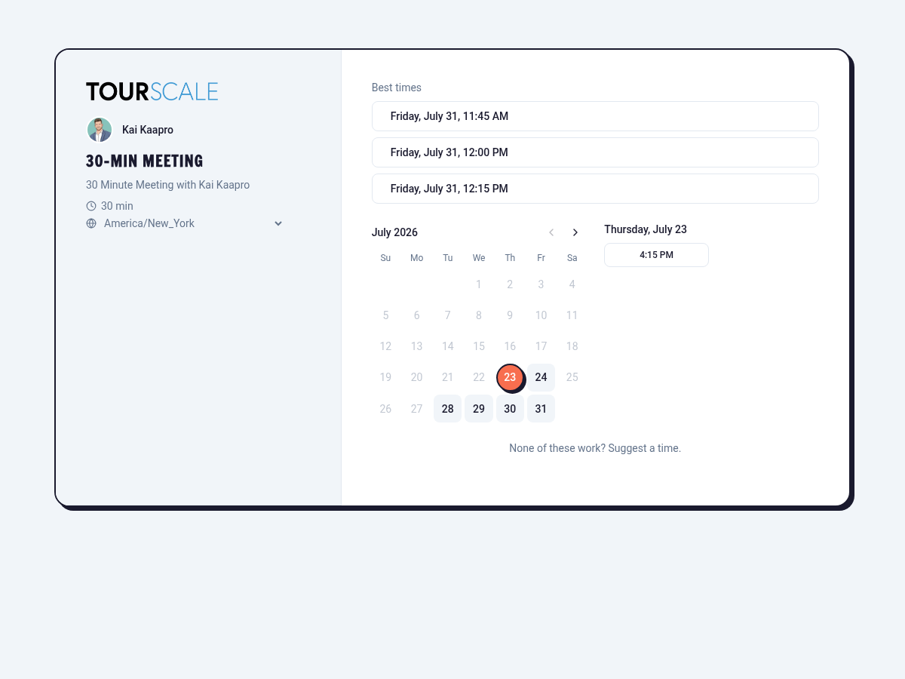
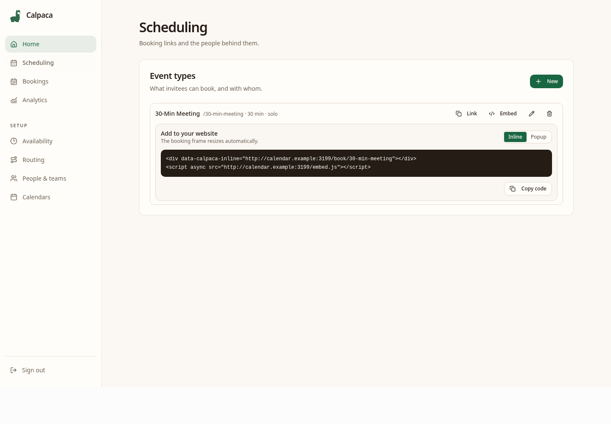
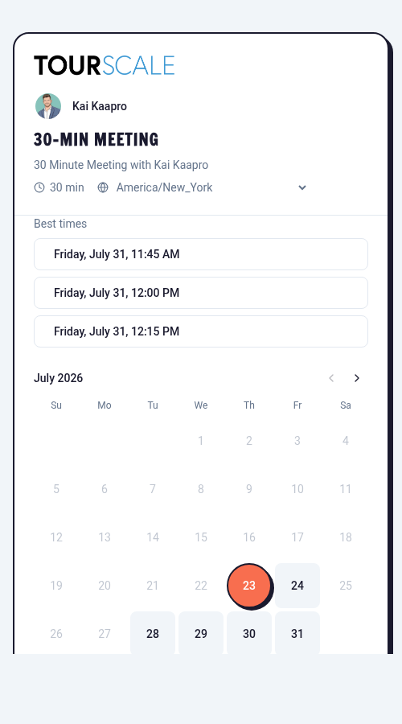

# Calpaca

Calpaca is a lightweight, open-source scheduling platform for people and
agents. It combines a polished booking page with group scheduling, scored
availability, Google Calendar sync, and an MCP server for AI-assisted booking.

[Live demo](https://cal.tourscale.com) ·
[Architecture](docs/ARCHITECTURE.md) ·
[MCP setup](docs/MCP.md) ·
[API reference](docs/API.md) ·
[Hosted service](docs/HOSTED.md) ·
[Embeds](docs/EMBEDS.md) ·
[Self-hosting](docs/SELF-HOSTING.md) ·
[Roadmap](docs/FEATURE-PARITY-ROADMAP.md)

## Why Calpaca

- **One small stack:** Bun application + PostgreSQL. No Redis, message broker,
  or separate worker service.
- **Correct availability:** DST-safe time handling, buffers, minimum notice,
  focus blocks, and ranked suggestions.
- **Teams built in:** round-robin assignment, required and optional group
  attendees, and quorum fallback when no time works for everyone.
- **Date-aware availability:** recurring hours, alternate-date hours, time-off
  ranges, and teammate forwarding.
- **Agent-ready:** a stdio MCP server exposes availability, holds, booking,
  rescheduling, and cancellation through the same public API as the web app.
- **Reliable calendar sync:** Google Calendar busy-cache reads, watch-channel
  renewal, native calendar writes, and email fallback when Google is
  unavailable.
- **Auditable bookings:** an append-only event log is the source of truth;
  the bookings table is a projection.

## Screenshots








## Stack

TypeScript, Bun, Hono, React 19, Vite, Tailwind CSS v4, Drizzle ORM,
PostgreSQL 16, pg-boss, Better Auth, and the Temporal API.

## Quickstart

You need [Bun](https://bun.sh/) and PostgreSQL 16. The commands below start a
local PostgreSQL container; an existing PostgreSQL server works just as well.

```sh
git clone https://github.com/e1i3or-commits/Calpaca.git
cd Calpaca
bun install
cp .env.example .env.local

docker run --name calpaca-postgres \
  -e POSTGRES_USER=test \
  -e POSTGRES_PASSWORD=test \
  -e POSTGRES_DB=app \
  -p 5434:5432 \
  -d postgres:16

bunx drizzle-kit migrate
bun run build:web
bun run start
```

Open <http://localhost:3000>. The example environment is enough to start the
application, but Google sign-in, calendar sync, and email delivery remain
disabled until their credentials are configured.

For frontend development, run the API and Vite server in separate terminals:

```sh
bun run start
bun run dev:web
```

Then open <http://localhost:5173>.

> Keep `DATABASE_URL` and `TEST_DATABASE_URL` pointed at different databases.
> Integration tests truncate their database.

## Configuration

Copy `.env.example` to `.env.local`. The main settings are:

| Variable | Purpose |
|---|---|
| `DATABASE_URL` | PostgreSQL connection used by the application and jobs |
| `BETTER_AUTH_SECRET` | Session-signing secret |
| `BETTER_AUTH_URL` | Public application origin |
| `GOOGLE_CLIENT_ID`, `GOOGLE_CLIENT_SECRET` | Google OAuth and Calendar sync |
| `INVITEE_CALENDAR_CALLBACK_URL` | Optional canonical callback for the anonymous invitee calendar overlay; defaults to `${BETTER_AUTH_URL}/api/invitee-calendar/callback` |
| `PUBLIC_URL` | Public HTTPS origin for calendar webhooks and email links |
| `SMTP_URL`, `EMAIL_FROM` | Booking and reminder email delivery |
| `DISABLE_JOBS=1` | Disable in-process pg-boss workers |

See [.env.example](.env.example) for details and safe local defaults.

For a production-like Docker Compose deployment, use the portable example in
[Self-hosting Calpaca](docs/SELF-HOSTING.md). The file at
`deploy/compose.yml` is the maintainer's deployment and is not a reusable
configuration template.

## MCP server

Once the API is running, add Calpaca to Claude Code:

```sh
claude mcp add calpaca \
  -e SCHEDULER_API_URL=http://localhost:3000 \
  -- bun run mcp
```

Event types must explicitly allow agent access. See [docs/MCP.md](docs/MCP.md)
for tool behavior, policy enforcement, and desktop-client configuration.

## Development

```sh
bun run typecheck
bun run lint
bun test
bun run verify
```

Database-backed tests use `TEST_DATABASE_URL` and skip cleanly when it is not
set. See [CONTRIBUTING.md](CONTRIBUTING.md) before proposing changes; Calpaca's
small infrastructure and dependency budget is a deliberate product constraint.

## Project status

The core scheduling engine, booking UI, Google integration, outbound
notifications, routing forms, group scheduling, analytics, user management,
and MCP read/write tools are implemented. Additional scheduling modes and
integration work remain on the
[feature-parity roadmap](docs/FEATURE-PARITY-ROADMAP.md).

Calpaca is under active development. Review configuration and security for your
environment before operating a public instance.

## License

Calpaca is licensed under the
[GNU Affero General Public License v3.0](LICENSE).
If you modify Calpaca and provide it as a network service, the AGPL requires
you to offer the corresponding source code to users of that service.
